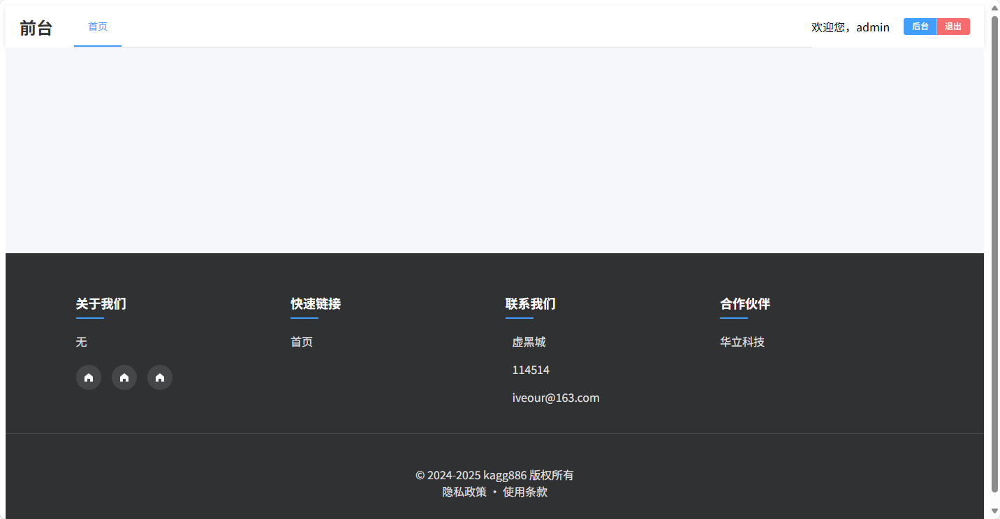
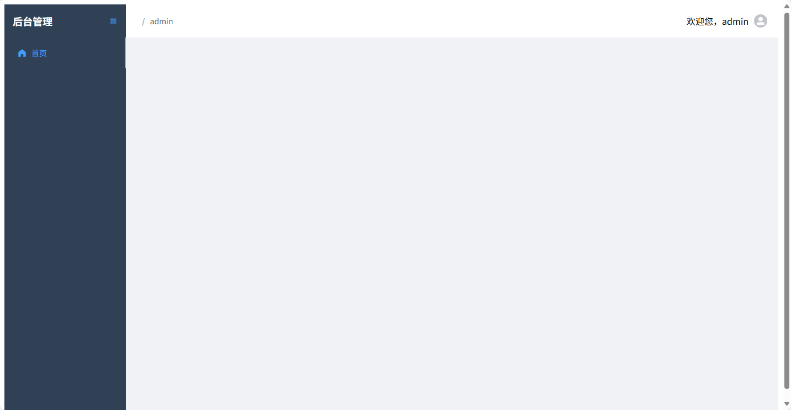
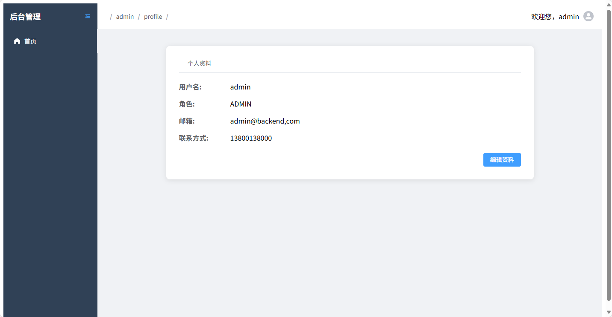

# Backend-Builder

更适合 **毕设/课设** 的**极简**项目脚手架。架构简单，极易扩展。

~~为什么没有演示页面？自己部署去~~

## 0. 运行截图







## 1. 前端

### 1. 技术栈

| 库名                                                       | 作用                                             |
| ---------------------------------------------------------- | ------------------------------------------------ |
| [axios](https://axios.nodejs.cn/docs/intro)                | 用于网络请求以及通用拦截器                       |
| [echarts](https://echarts.apache.org/)                     | 图表组件集成                                     |
| [md-editor-v3](https://imzbf.github.io/md-editor-v3/en-US) | 富文本编辑器，开启所见即所得模式可以当富文本用。 |
| [piana](https://pinia.vuejs.org/)                          | 状态管理框架，状态管理可以将页面和api结合起来    |
| [element-plus](https://element-plus.org/)                  | UI库，轻量简洁                                   |

### 2. 文件结构

```shell
fronted/
├── index.html
├── package.json
├── pnpm-lock.yaml
├── public
│   └── vite.svg
├── src
│   ├── App.vue
│   ├── api //API层
│   │   ├── auth.ts
│   │   ├── dto.ts
│   │   └── user.ts
│   ├── main.ts
│   ├── pages
│   │   ├── 404.vue
│   │   ├── backend //后台页面
│   │   │   ├── home
│   │   │   │   └── index.vue
│   │   │   ├── index.vue
│   │   │   ├── profile
│   │   │   │   ├── index.vue
│   │   │   │   └── profile
│   │   │   │       └── index.vue
│   │   │   └── user
│   │   │       └── index.vue
│   │   ├── fronted //前台页面
│   │   │   ├── home
│   │   │   │   └── index.vue
│   │   │   └── index.vue
│   │   ├── login.vue
│   │   └── register.vue
│   ├── route
│   │   ├── index.ts //路由配置
│   │   └── router.ts
│   ├── store //仓储层
│   │   └── user.ts
│   ├── style.css
│   ├── util
│   │   └── axios.ts //axios配置
│   └── vite-env.d.ts
├── tsconfig.app.json //tsconfig配置
├── tsconfig.json
├── tsconfig.node.json
└── vite.config.ts //vite配置

```

### 3. 运行方式

> [!IMPORTANT]  
> 推荐使用 Node.JS 20

```bash
pnpm install
pnpm run dev
```


## 2. 后端 (Java)

### 1. 技术栈

| 库名                                                | 作用                    |
| --------------------------------------------------- | ----------------------- |
| [Lombok](https://projectlombok.org/)                | 基于注解的模板代码生成  |
| [JWT](https://github.com/FusionAuth/fusionauth-jwt) | JWT解析 & 生成          |
| [Mybatis](https://mybatis.org/mybatis-3/)           | 持久层框架，生成SQL查询 |
| [Mybatis-Plus](https://baomidou.com/)               | 封装常用CURD语句        |


### 2. 文件结构

```
backend-java/
├── build.gradle.kts //构建脚本
├── gradle
│   └── wrapper
│       ├── gradle-wrapper.jar
│       └── gradle-wrapper.properties //gradle配置
├── gradlew
├── gradlew.bat
├── settings.gradle.kts //插件配置
└── src
    ├── main
    │   ├── java
    │   │   └── top
    │   │       └── kagg886
    │   │           └── backend
    │   │               ├── BackendApplication.java //启动类
    │   │               ├── config
    │   │               │   ├── JacksonConfig.java //配置jackson，避免Long精度问题
    │   │               │   ├── MvcConfig.java //配置登录拦截器，CORS配置
    │   │               │   ├── MyBatisPlusConfig.java //配置分页
    │   │               │   └── UploadConfig.java //配置上传，无需使用OSS功能
    │   │               ├── controller //Controller层
    │   │               │   ├── AuthController.java
    │   │               │   ├── UploadController.java
    │   │               │   └── UserController.java
    │   │               ├── dto //配置DTO
    │   │               │   └── BaseResponse.java
    │   │               ├── entity //配置实体类
    │   │               │   └── User.java
    │   │               ├── interceptor //配置拦截器
    │   │               │   ├── RequireLogin.java //登录拦截注解
    │   │               │   ├── RequireLoginInterceptor.java //处理登录拦截注解的过滤器
    │   │               │   └── ResponseWrapperAdvice.java //统一返回包装
    │   │               ├── mapper //Mapper层
    │   │               │   └── UserMapper.java
    │   │               ├── service //Service层
    │   │               │   ├── UserService.java
    │   │               │   └── impl
    │   │               │       └── UserServiceImpl.java
    │   │               └── util
    │   │                   ├── JWT.java //JWT token生成
    │   │                   ├── LocalDateTimeAsStringDeSerializer.java
    │   │                   └── LocalDateTimeAsStringSerializer.java
    │   └── resources
    │       └── application.properties //启动配置
    └── test
        └── java
            └── top
                └── kagg886
                    └── backend
                        └── BackendApplicationTests.java //测试类
```


### 3. 运行方式

> ![IMPORTANT]
> 推荐使用最新版本的IDEA运行

> ![IMPORTANT]
>
> 推荐使用Java17+的版本运行

1. 前往 `backend-java/src/main/resources/application.properties`，配置数据库账户密码
1. 使用IDEA进行启动。


## 3. TO-DO

- [ ] Python后端
